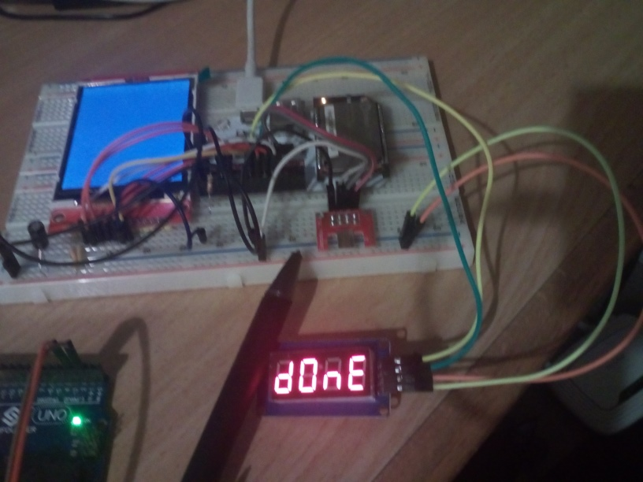

# TM1637 for the Omega2
Library and example code for controlling TM1637 4-digit seven-segment LED displays.

## Compiling
You must have the cross-compiler setup and in your path (see https://github.com/OnionIoT/source). `mipsel-openwrt-linux-g++` should be in your path. 

Furthermore, the `Makefile` references include and library directories. These are needed for the header files of `ugpio.h` and the `libugpio.so` to link against.

You can download these files at https://github.com/gamer-cndg/omega2-libs and change the path in the `Makefile`.

## Using 

Since this program uses the `libugpio` library to control GPIO pins, you must have it installed on your Omega2.

Do so by executing 

```sh 
opkg update && opkg install libugpio
```

You can then transfer the binary `tm1637_example_display` and execute it. 

## Wireup

The module's 4 pins should be connected to the Omega2 as follows:

* GND -> GND 
* VCC -> 3.3V
* CLK -> any free GPIO 
* DIO -> any free GPIO  

The demo program will ask which pin you chose for clock and data during runtime and use those.

## Media 

Working version: 



## ToDos 

* ~~check if this code works with a real display at all~~ **Yes it does!**
* ~~write better controllable example program~~ **Now configurable via console input**
* write Python version which only uses pyOnionGpio 
* package nicely

## License

This is a port of the GPLv3 licensed work at https://github.com/avishorp/TM1637 by avishorp@gmail.com.

The modifications are stated in the `TM1637.cpp` file. 

The `Arduino.cpp/.h` layer was written by me.